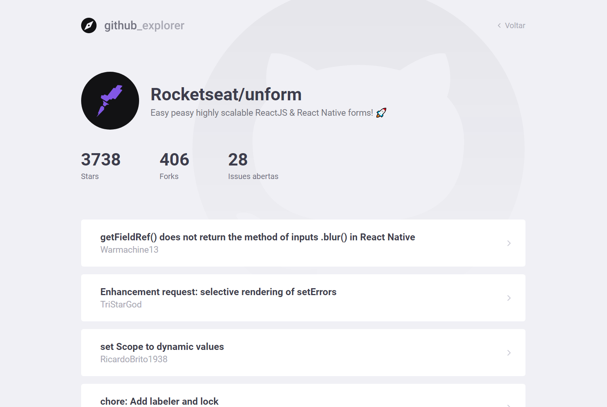

# github-explorer

Github-explorer is a simple application that lists the github api repositories.

##### Technologies used:

- ReactJS
- Javascript
- Typescript
- JSX
- Visual Studio Code on Windows

##### PrintScreen

  
  

